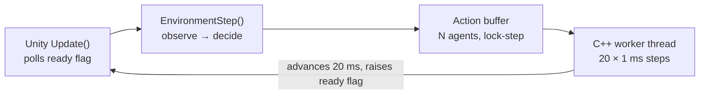

# VoxUnityML

### ** Parallel Multi-Soft-Robot Reinforcement Learning in Unity, powered by Voxelyze 3D Voxel Physics Engine **


> **Work in progress.** Released early to document prior research and for demonstration.
> APIs and training configurations are still moving.

---
### Unity Editor Working Screen


---
### Training in Action (MP4)
<a href="https://youtu.be/SqiNJGC3jWg" target="_blank">
  
</a>

## What it does

Unity's PhysX cannot simulate soft bodies, so this project runs
**[Voxelyze](https://github.com/jonhiller/Voxelyze)** — Jon Hiller's 3D voxel physics engine — as
the physics core and bridges it into Unity ML-Agents. Dozens of independent soft robots train in
parallel inside a single scene, each with isolated memory in the DLL, while Unity renders at
60+ FPS without ever blocking on physics.

The result is a soft-robot RL testbed that scales with core count rather than with GPU budget.

## Highlights

- **C++ physics core** — [Voxelyze](https://github.com/jonhiller/Voxelyze) 3D voxel physics, stepped
  from Unity rather than running free. Each voxel carries full 6-DOF state; deformation, collision
  and thermal actuation are computed natively.
- **Nested OpenMP parallelism** — a persistent parallel region parallelises across robots (macro)
  and across voxels within a robot (micro), with no fork-join churn per step.
- **Processor-group thread pinning** — Windows affinity APIs keep 64+ core HEDT machines
  (AMD Threadripper class) fully utilised across processor groups.
- **Zero-GC data bridge** — vertex and state data cross from C++ to Unity as `IntPtr` and are
  consumed by the Burst compiler directly into mesh buffers. No managed allocation per frame.
- **Lock-free triple buffering** — rendering reads a completed snapshot while physics writes the
  next one; heavy simulation never stalls the frame.
- **Bi-directional PhysX coupling** — continuous two-way collision, force and torque exchange
  between Unity rigidbodies and Voxelyze soft bodies.
- **Direct thermal actuation** — the policy sets a target temperature per muscle voxel; a
  first-order actuator model (τ ≈ 50 ms) turns discontinuous commands into smooth deformation
  without a hand-designed gait generator.

---

## Quick start

```bash
# 1. Build the C++ DLL (Visual Studio, x64 Release) and copy it into the Unity project.

# 2. Open SingleArenaScene in Unity 6.

# 3. Start the trainer, then press Play.
mlagents-learn config/VoxBot33.yaml --run-id=VoxBot_01
```

The console should report the wiring:

```
[VoxelEngineCore] Total 2 robots indexed sequentially across 1 training areas.
[VoxelRLManager] 1 robots, actionSize=33
```

Full walkthrough → **[VoxUnityML: First Training Run](https://neuronomicon.github.io/VoxUM.html)**

---

## Architecture

Three layers connected by pointers rather than by serialisation:

| Layer | Language | Responsibility |
|---|---|---|
| Physics | C++ DLL | Voxel dynamics, collision, multi-threading, per-robot memory isolation |
| Bridge & render | C++ / C# | Triple-buffered state and vertex transfer, Burst mesh upload |
| RL & interaction | Unity C# | Observation assembly, action dispatch, lock-step stepping, user input |

### The control loop

Physics runs on a background C++ thread, so Unity cannot step the Academy on a fixed schedule.
`VoxelRLManager` disables automatic stepping and drives the cycle by hand, waiting on a ready flag
before releasing the next batch of actions.



> **Never attach a `Decision Requester`.** It would request decisions on Unity's own schedule,
> independent of the worker thread, and agents would submit actions while physics is mid-flight.
> The manager calls `RequestDecision()` for every agent itself.

Because stepping is driven from `Update()` rather than `FixedUpdate()`, raising `time_scale` does
**not** speed up training — `target_frame_rate: -1` is the knob that matters.

---

## Observation and action space

Body geometry and task objective are separate ScriptableObjects, so one robot body can be reused
across many tasks. Observation and action sizes are **derived** from the body profile and pushed
into `BehaviorParameters` — they are never typed in by hand.

**Observation** — body-local frame, measured relative to the centre of mass:

| Index | Contents | Count |
|---|---|---|
| 0–2 | Target direction (unit x, z) and normalised distance | 3 |
| 3–5 | Centre-of-mass velocity | 3 |
| 6–8 | Mean angular velocity | 3 |
| 9–206 | Per voxel: position and velocity relative to CoM | 6 × 33 |
| 207–239 | Previous action | 33 |

The previous-action block is not optional. Actuators carry a first-order lag, so the next state
depends on commands issued several steps earlier; feeding the last action back restores the Markov
property the policy needs.

**Action** — one continuous value per muscle voxel:

```
a ∈ [-1, +1]  →  target temperature = a × 12
                 contract ←──────────→ expand

current += (target - current) × 0.02   per 1 ms micro-step   (τ ≈ 49.5 ms)
```

The lag is applied inside the micro-step loop, so actuator dynamics stay fixed in wall-clock terms
regardless of the decision rate.

---

## Key files

```
cpp/
  Unity_Voxel_RL_DLL.cpp            RL entry points, reset, lock-step handoff
  Unity_Voxel_RL_Actions_DLL.cpp    actuation modes (direct thermal / legacy CPG)
  Unity_Voxel_FuncDLL.cpp           engine boot, worker thread, OpenMP robot loop
  Voxelyze_Nested.cpp               nested-parallel time step

Assets/Scripts/RL/
  RobotBodyProfile.cs               anatomy, muscle count, observation layout
  RobotTaskProfile.cs               abstract task: rewards, termination, sizes
  TargetTrackingProfile.cs          concrete task implementation
  VoxelRobotAgent.cs                ML-Agents agent (delegates to the profile)
  VoxelRLManager.cs                 lock-step decision cycle

Assets/Scripts/Editor/
  AutoBuilder.cs                    dual graphics + headless server build

config/VoxBot33.yaml                PPO hyperparameters and engine settings
```

## Scaling

| Scene | Arenas | Simulated robots | Outer threads |
|---|---|---|---|
| `SingleArenaScene` | 1 | 2 | 2 |
| `MultiArenaScene04` | 4 | 8 | 8 |
| `MultiArenaScene16` | 16 | 32 | 32 |

Each arena holds one RL robot plus one non-learning companion body. Total thread demand is
*robots × per-robot `threadCount`* — oversubscribing a 64-core machine makes 16 arenas slower
than 4, so lower `threadCount` as arena count rises.

Keep the training YAML identical across scenes when comparing them. `buffer_size` counts total
agent steps, so the number of policy updates at a given step count is unchanged — which is what
makes the comparison meaningful.

---

## Roadmap

- [ ] Terrain and obstacle task variants beyond target tracking
- [ ] Morphology co-optimisation (evolving the voxel layout alongside the controller)
- [ ] Contact-state observations for gait learning on uneven ground
- [ ] Linux / headless cluster support

## Acknowledgements

Built on [Voxelyze](https://github.com/jonhiller/Voxelyze), the 3D voxel physics engine by
Jonathan Hiller and Hod Lipson (*Dynamic Simulation of Soft Multimaterial 3D-Printed Objects*,
Soft Robotics, 2014).
Observation and action design draws on *Evolution Gym* (Bhatia et al., NeurIPS 2021).

---

#### Copyright (c) Y.S.Shim, J.M.Hwang, PCU-Game Lab., Pai Chai Univ., Daejeon, South Korea. All rights reserved.
